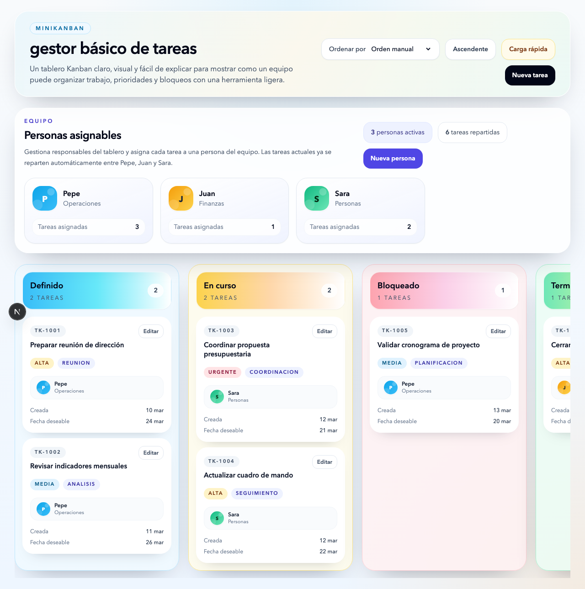
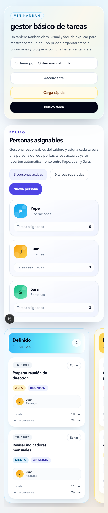

# miniKanban

`miniKanban` es una demo web de un tablero Kanban moderno, clara y visual, pensada para enseñar en una clase cómo organizar trabajo, prioridades y responsables con una aplicación ligera.

La demo combina dos ideas principales:
- gestión visual del flujo de trabajo con Kanban
- gestión sencilla de personas responsables dentro del equipo

## Qué muestra la demo

La aplicación trabaja en una única pantalla y está pensada para ser fácil de explicar en una sesión con directivos, mandos o equipos de trabajo.

Incluye:
- 4 columnas fijas: `Definido`, `En curso`, `Bloqueado` y `Terminado`
- tarjetas compactas con prioridad, tipo, fechas y responsable
- drag & drop para mover y reordenar tareas cuando el orden es manual
- edición completa de tareas mediante modal
- edición rápida inline del título
- carga rápida para crear varias tareas de una vez
- franja superior de personas con `Pepe`, `Juan` y `Sara`
- creación de nuevas personas con nombre, área y foto o avatar
- asignación de personas a tareas
- persistencia en `localStorage`

## Capturas

### Vista general del tablero



### Vista compacta



## Funcionalidad principal

### 1. Gestión de tareas

Cada tarea incluye:
- identificador
- fecha de creación
- título
- tipo
- prioridad
- fecha deseable de fin
- observaciones
- enlace
- estado
- persona asignada
- índice de orden dentro de la columna

Operaciones disponibles:
- crear tareas nuevas
- editar todos los campos
- editar rápidamente solo el título
- eliminar con confirmación
- mover tareas entre columnas
- reordenar tareas dentro de la misma columna

### 2. Gestión de personas

La franja superior del tablero muestra un pequeño equipo de ejemplo:
- Pepe
- Juan
- Sara

Cada persona tiene:
- nombre
- área
- foto o avatar

Además, la demo permite:
- crear nuevas personas
- asignar una persona a cada tarea
- visualizar rápidamente quién es responsable de cada tarjeta

### 3. Ordenación y uso en clase

La demo permite ordenar el tablero por:
- orden manual
- título
- tipo
- prioridad
- fecha deseable
- fecha de creación

Cuando el orden no es manual, el drag & drop se desactiva para evitar incoherencias.

Esto hace que la aplicación sea útil para explicar en una clase:
- la diferencia entre flujo visual y ordenación automática
- la trazabilidad del trabajo
- la importancia de asignar responsables
- cómo una herramienta ligera puede cubrir necesidades reales de coordinación

## Tecnología usada

- Next.js con App Router
- TypeScript
- React
- Tailwind CSS
- persistencia local con `localStorage`

## Instalación

En la carpeta del proyecto, ejecuta:

```bash
npm install
```

## Cómo arrancar

Para desarrollo:

```bash
npm run dev
```

Después abre [http://localhost:3000](http://localhost:3000) en el navegador.

Si ese puerto estuviera ocupado, Next.js usará otro puerto disponible y lo indicará en la terminal.

## Cómo generar la versión de producción

```bash
npm run build
```

## Despliegue en GitHub Pages

El repositorio ya incluye un workflow listo en `.github/workflows/deploy-pages.yml`.

Pasos:

1. Sube el proyecto a GitHub.
2. Comprueba que la rama principal del repo es `main`.
3. En GitHub entra en `Settings > Pages`.
4. En `Build and deployment`, selecciona `Source: GitHub Actions`.
5. Haz `push` a `main` y GitHub ejecutará el workflow automáticamente.
6. Cuando termine, la web quedará publicada en GitHub Pages.

La URL será normalmente una de estas:
- `https://usuario.github.io/` si el repositorio se llama `usuario.github.io`
- `https://usuario.github.io/nombre-del-repo/` si es un repositorio de proyecto

Si tu rama principal no se llama `main`, cambia ese nombre dentro de `.github/workflows/deploy-pages.yml`.

## Persistencia

La demo guarda datos en `localStorage`, por lo que:
- las tareas creadas o editadas permanecen al recargar
- las personas nuevas permanecen al recargar
- las asignaciones entre tareas y personas también se mantienen

## Qué hacer si no tienes npm

`npm` se instala junto con Node.js.

### En Windows

1. Descarga la versión LTS de Node.js desde la web oficial: [https://nodejs.org/](https://nodejs.org/)
2. Ejecuta el instalador.
3. Si aparece la opción, deja activado añadir Node al `PATH`.
4. Cierra y vuelve a abrir la terminal.
5. Comprueba la instalación:

```bash
node -v
npm -v
```

### En macOS

Opción recomendada:

1. Descarga la versión LTS de Node.js desde la web oficial: [https://nodejs.org/](https://nodejs.org/)
2. Ejecuta el instalador.
3. Cierra y vuelve a abrir la terminal.
4. Comprueba la instalación:

```bash
node -v
npm -v
```

Alternativa con Homebrew, si ya lo usas:

```bash
brew install node
node -v
npm -v
```

## Estructura funcional del proyecto

Las piezas principales son:
- `componentes/tablero-kanban.tsx`: orquestación principal de la pantalla
- `componentes/panel-personas.tsx`: franja superior de personas
- `componentes/columna-kanban.tsx`: columnas del tablero
- `componentes/tarjeta-tarea.tsx`: tarjeta compacta de cada tarea
- `componentes/modal-tarea.tsx`: edición completa de tareas
- `componentes/modal-persona.tsx`: alta de nuevas personas
- `lib/tareas.ts`: utilidades de tareas, ordenación y movimientos
- `lib/personas.ts`: utilidades de personas, avatares y asignaciones

## Uso recomendado para demo o clase

Una secuencia sencilla para enseñar la aplicación es:

1. Mostrar el panel general y explicar las 4 columnas.
2. Señalar la franja superior de personas y la asignación de responsables.
3. Crear una tarea nueva.
4. Editarla y cambiar prioridad, fecha y persona asignada.
5. Moverla entre columnas con drag & drop.
6. Probar la carga rápida para enseñar productividad.
7. Cambiar el criterio de ordenación para explicar la diferencia entre orden manual y orden automático.
