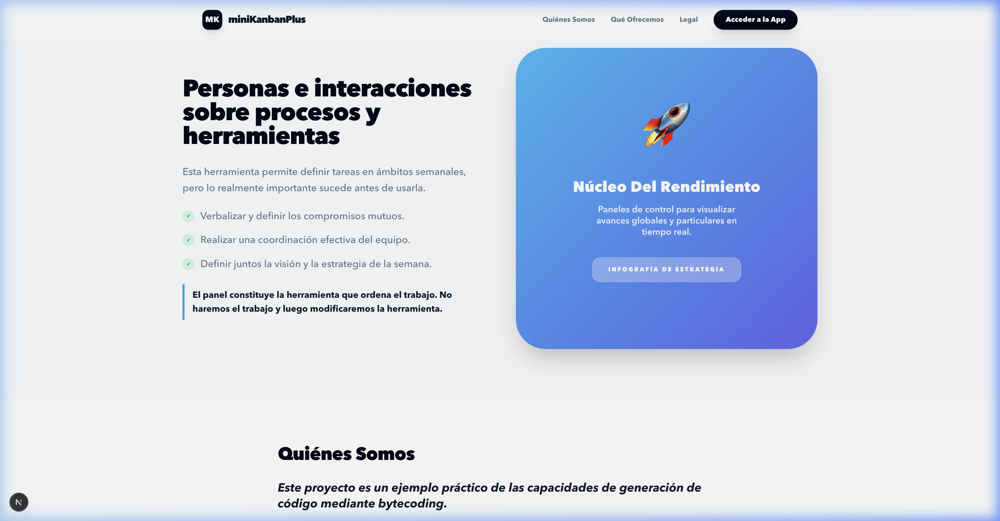
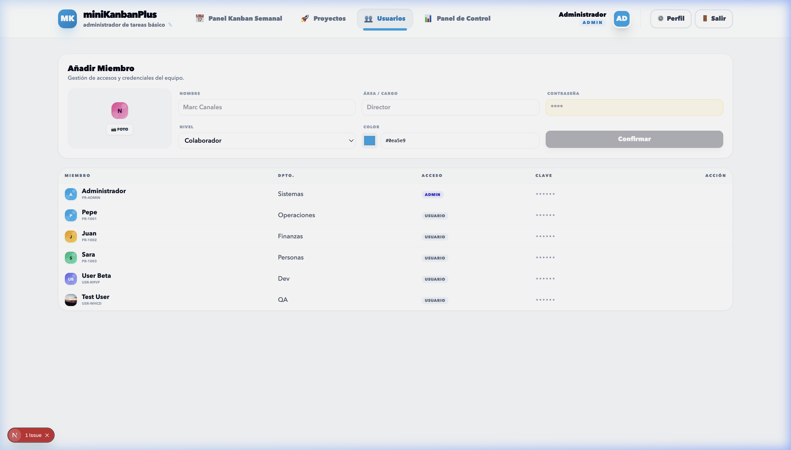
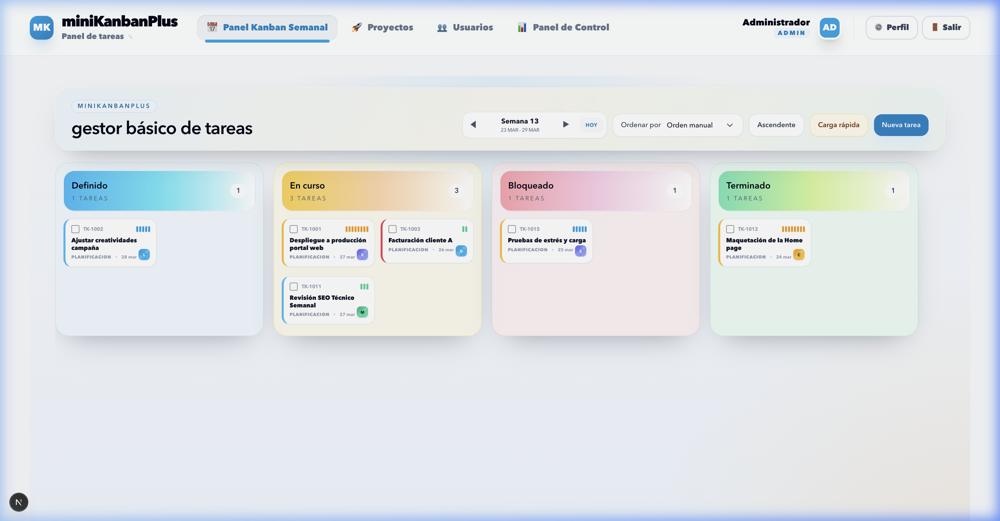
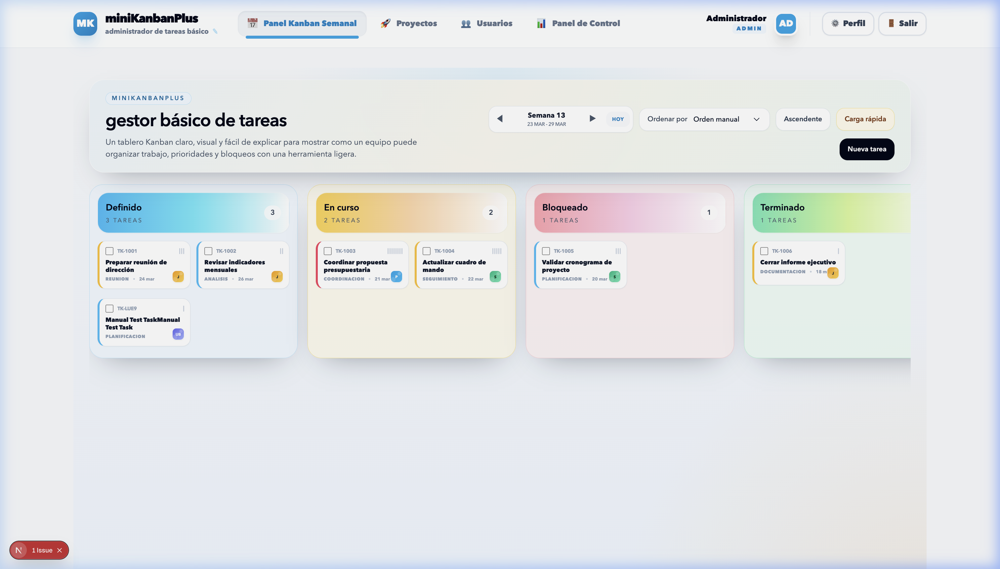
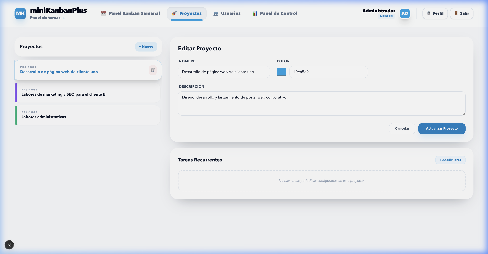
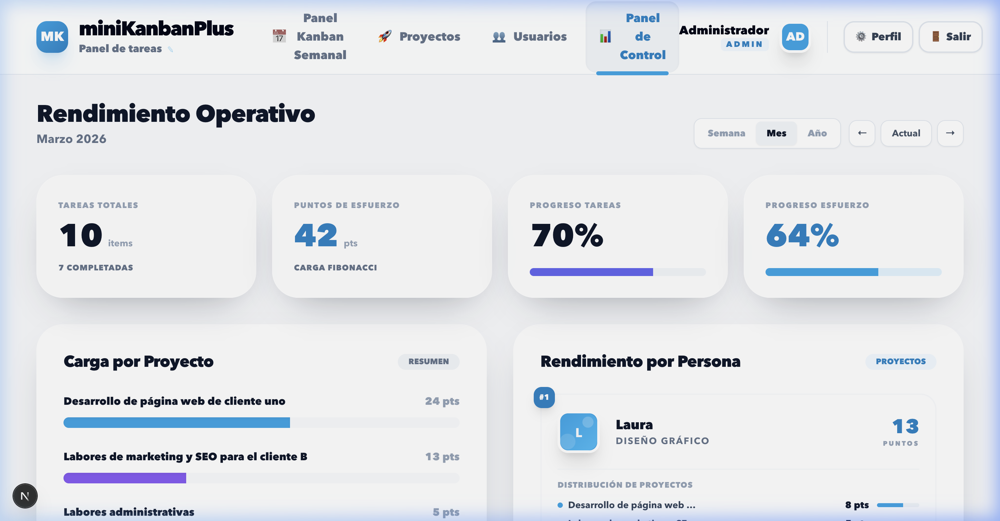

# 🏢 miniKanbanPlus

**Agilidad es la base para el Alto Rendimiento.**

`miniKanbanPlus` es un gestor de tareas visual, ligero y potente, diseñado bajo el paradigma de **Vibe Coding** con Inteligencia Artificial. Está pensado para ayudar a equipos a organizar su trabajo semanal, priorizar compromisos y visualizar su rendimiento de manera inmediata sin complejas configuraciones de servidor.

🟢 **Demostración en Vivo:** [https://rcanalescoder.github.io/miniKanbanPlus/](https://rcanalescoder.github.io/miniKanbanPlus/)


*Landing page pública explicando la filosofía Agile y la inversión de control.*

---

## ✨ Características y Secciones Completas

### 1. Acceso y Usuarios
La plataforma cuenta con una página web pública y un entorno de trabajo protegido. Por defecto, el sistema viene provisionado con un usuario administrador pionero:
- **Usuario**: `admin`
- **Contraseña**: `admin`


*Ventana de administración donde puedes dar de alta nuevos miembros, asignar roles y departamentos.*

### 2. Motor de Datos de Prueba (Generador de Demos)
Ideal para demostraciones ágiles. El usuario Administrador puede ir a su pantalla de *Ajustes de Perfil -> Mi Seguridad* y encontrar los siguientes controles interactivos:
- **Generar Datos de Ejemplo**: Inyecta automáticamente 3 proyectos, 5 empleados de diferentes departamentos de una agencia, y decenas de tareas a lo largo de varias semanas para poblar los informes listos para usarse.
- **Borrar Todo**: Funcionalidad de 'Hard Reset' para dejar el navegador limpio de fábrica.


*Controles avanzados de administración y depuración de ejemplos de "Vibe Coding".*

### 3. Panel Kanban Semanal
El núcleo operativo del equipo. Permite visualizar el flujo de trabajo de Lunes a Domingo. 
Puedes introducir nuevas tareas, decidir su prioridad, la complejidad (en puntos), la persona responsable y **navegar cómodamente hacia Semanas Anteriores y Siguientes** para retrospectivas históricas o planificaciones futuras.


*El panel Kanban con su diseño vibrante y las tareas categorizadas.*

### 4. Gestión de Proyectos (Entorno Maestro-Detalle)
Una configuración visual en pantalla partida (Split View) de alta productividad. A la izquierda navegas por la lista viva de tus proyectos y a la derecha visualizas el inspector del proyecto en tiempo real.
Además, permite definir **Tareas Recurrentes** dentro de cada proyecto, que aseguran el ciclo regular de labores.


*Pestaña de proyectos desplegada como maestro (izquierda) y detalle dinámico (derecha).*

### 5. Panel de Control (Dashboard Stats)
Toda estrategia necesita medición para explicar su éxito. El panel de informes cuantifica el trabajo del equipo agregando los puntos de complejidad (Fibonacci) resueltos por las personas y dividiéndolos en los proyectos activos.
Permite visualizar la eficiencia saltando libremente en la línea temporal: agrupa los datos analíticos por **Semana, Mes o Año**.


*Reportes visuales del rendimiento en base al tiempo.*

---

## 🛠️ Instalación y Uso Local

1. **Clonar el repositorio**:
   ```bash
   git clone https://github.com/tu-usuario/miniKanbanPlus.git
   ```
2. **Instalar dependencias**:
   ```bash
   npm install
   ```
3. **Variables de Entorno (Opcional)**:
   Si deseas configurar una **Llave Maestra de Emergencia** (por si olvidas la contraseña local de admin):
   Crea un archivo `.env.local` en la raíz con el siguiente contenido:
   ```env
   NEXT_PUBLIC_MASTER_PASSWORD=TuSuperClaveSecreta123
   ```
4. **Ejecutar en desarrollo**:
   ```bash
   npm run dev
   ```
   Accede a `http://localhost:3000`

---

## 🌍 Arquitectura y Despliegue en GitHub Pages
La aplicación tiene un comportamiento `cero configuración`. Funciona exclusivamente almacenando la lógica en la memoria local del navegador (`localStorage`), y está lista para exportarse en estático sin requerir backend, bases de datos o motores de Node.js en producción.

1. **Generar la build** estática:
   ```bash
   npm run build
   ```
2. **Subir la carpeta `out`** a la rama `gh-pages` de tu repositorio de GitHub, o configurar una Action para que apunte directamente a la publicación estática.

## ⚖️ Licencia
Este proyecto se distribuye bajo la **Licencia MIT**. 
*Nota: Se requiere mención o contribución explícita reconociendo a Roberto Canales Mora en cualquier derivación o uso comercial/demostrativo originado desde este código.*
